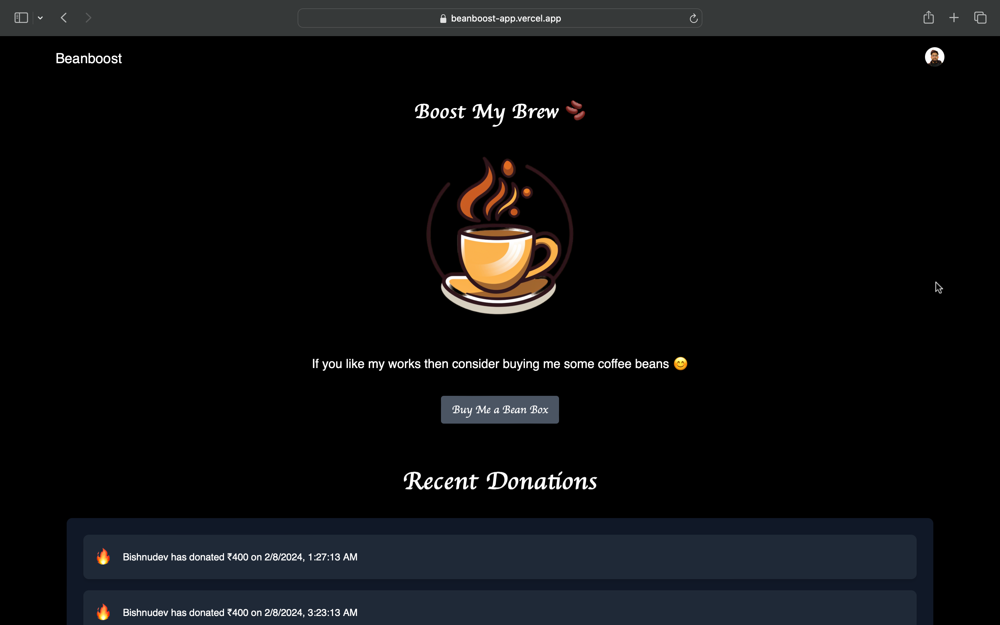

# Beanboost

<div align="center">
  
</div>

## 🚀 Overview

Beanboost is a self-patron app built with Next.js and TypeScript, designed to support creators through direct contributions. The app utilizes Clerk for authentication and showcases a sleek, modern UI with Next.js. 

## 🛠️ Tech Stack

- **Frontend**: [Next.js](https://nextjs.org/) - A powerful React framework for building fast, scalable web applications.
- **Language**: [TypeScript](https://www.typescriptlang.org/) - A statically typed superset of JavaScript that provides type safety and enhances code quality.
- **Authentication**: [Clerk](https://clerk.dev/) - A modern authentication solution for managing user identities and security.
- **Backend as a Service**: [Appwrite](https://appwrite.io/) - An open-source backend server that simplifies the development of web and mobile applications.
- **Payment Gateway**: [Razorpay](http://razorpay.com/) - A commercial payment gateway providers which provides API's for making securable payments across internet.

## 🚀 Getting Started

To get started with Beanboost, follow these steps:

1. **Clone the Repository**:

   ```bash
   git clone https://github.com/your-username/beanboost.git
   cd beanboost
   ```
2. **Installing required dependencies**:
   ```bash
    npm install
   ```
3. **Setting up environment variables**:
   - Create a file named .env.local in root directory
   - Paste your own key with below format
   - ```bash
     NEXT_PUBLIC_CLERK_PUBLISHABLE_KEY="your-key"
     CLERK_SECRET_KEY="your-key"
     NEXT_PUBLIC_RAZORPAY_KEY_ID="your-key"
     NEXT_PUBLIC_RAZORPAY_KEY_SECRET="your-key"
     NEXT_PUBLIC_APPWRITE_PROJECT_ID="your-key"
     NEXT_PUBLIC_APPWRITE_DATABASE_ID="your-key"
     NEXT_PUBLIC_APPWRITE_DONATORS_COLLECTIONS_ID="your-key"
     NEXT_PUBLIC_APPWRITE_CONTACTS_COLLECTIONS_ID="your-key"
     ```
5. **Run the development server**:
   ```bash
    npm run dev
   ```
  - Open http://localhost:3000 in your browser to see the app in action.
    
4. **🤝 Contribution**:
  - Beanboost is an open-source project and we welcome contributions from the community. If you would like to contribute, please check out the      contributing guidelines and submit a pull request.
